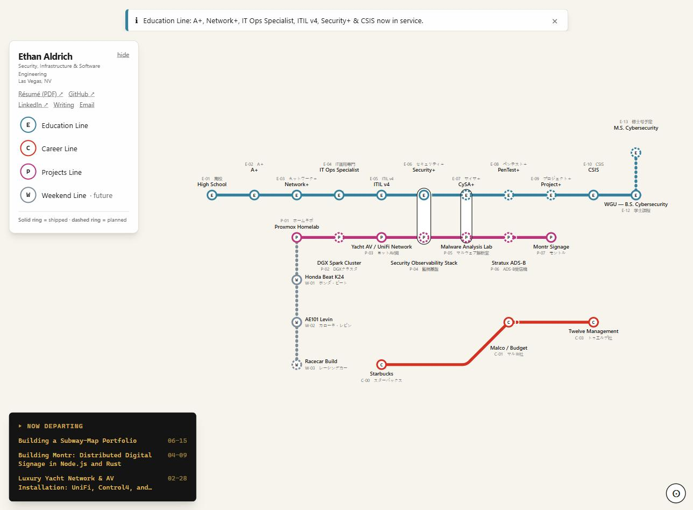

# ethanaldrich.org

[](https://github.com/0x000NULL/ethanaldrich.org/actions/workflows/test.yml)
[](./LICENSE)

**[ethanaldrich.org](https://ethanaldrich.org)**



A personal portfolio rendered as an interactive **Tokyo-Metro-style subway map**. Education, career, projects, and side interests are transit lines; milestones and case studies are stations; animated trains show what's "now serving" (in progress); and service alerts are announcements. Click a station for its case study, pan/zoom the map, or browse by keyboard.

Built with **Next.js 16** (App Router), **React 19**, **TypeScript**, **Tailwind CSS v4**, and **Zustand**. The map is hand-rolled inline SVG with a pure, DOM-free geometry layer — no charting or animation libraries.

## Getting started

```bash
npm install
npm run dev      # http://localhost:3000
```

## Scripts

| Command | Description |
|---|---|
| `npm run dev` | Start the dev server (localhost:3000) |
| `npm run build` | Production build |
| `npm run start` | Start the production server (`PORT` env, default 3000) |
| `npm run lint` | ESLint |
| `npm run test` / `test:run` | Vitest (watch / single run) |
| `npm run test:coverage` | Coverage report (90% gate) |
| `npm run test:e2e` | Playwright E2E |
| `npm run typecheck` | `tsc --noEmit` |
| `npm run build:resume` | Regenerate `public/resume.pdf` from `resume/resume.html` |

## How it works

The code is layered, lowest to highest:

1. **Data** (`src/data/subway/`) — immutable config (lines, stations, transfers, trains, alerts) is the single source of truth, guarded by a `validateConfig()` gate that enforces octolinear (0/45/90°) geometry and clean interchanges.
2. **Pure geometry/logic** (`src/lib/subway/`) — octolinear path math, pan/zoom transforms, and the train-animation reducer, all DOM-free and unit-tested (no SVG `getPointAtLength`, so it's SSR-deterministic).
3. **Render** (`src/components/subway/`) — inline SVG: lines, roundel stations, peanut interchanges, and trains.
4. **Interaction** (`src/hooks/`) — drag-pan/wheel-zoom, station panels, and a roving-tabindex screen-reader map.
5. **Living simulation** — animated trains, service alerts, and a "Now Departing" board of recent posts (all reduced-motion aware).

Every blog post and station also gets a statically generated, crawlable page for SEO and deep-linking (`/blog/<slug>`, `/station/<code>`, and `/?station=<code>` to open it on the map).

The blog reads MDX from `src/content/blog/`. Station case studies read MDX from `src/content/stations/`. Visitor stats persist to a gitignored `data/stats.json`.

See [`CLAUDE.md`](./CLAUDE.md) for the full architecture, conventions, and testing/deployment details.

## Deployment

Auto-deploys to DigitalOcean App Platform (`.do/app.yaml`) on push to `main`. CI (`.github/workflows/test.yml`) runs unit tests + coverage, Playwright E2E, lint, typecheck, build, and `npm audit` on Node 20; production dependencies must stay free of high and critical advisories for the build to pass. Dependabot watches npm and the Actions themselves.

See [`SECURITY.md`](./SECURITY.md) for how to report a vulnerability.
